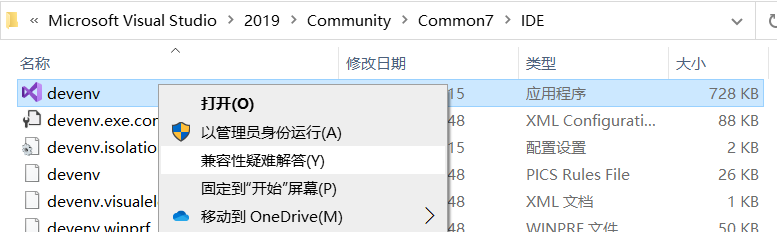
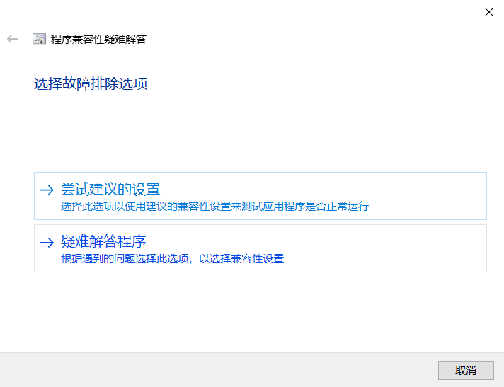
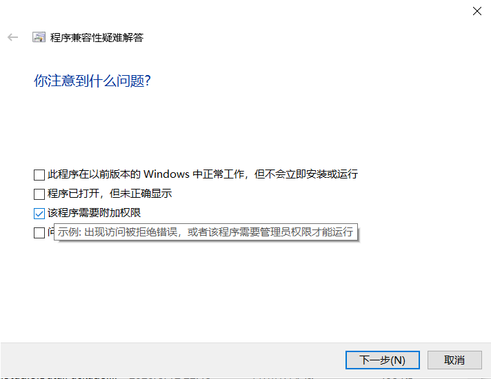
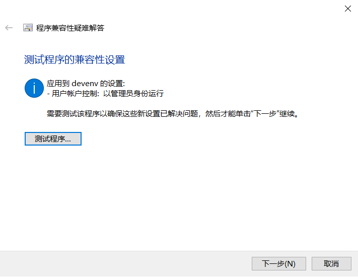

# Admin_VS2019_Always
Change to use Admin permission to run VS2019 permanently

## 1.Open path and select third option

Tip: `C:\Program Files (x86)\Microsoft Visual Studio\2019\Community\Common7\IDE\`

## 2.Open **Compatibility Program** and select Second item

## 3.Add Admin Permission

## 4.Test one time

## 5.Save

